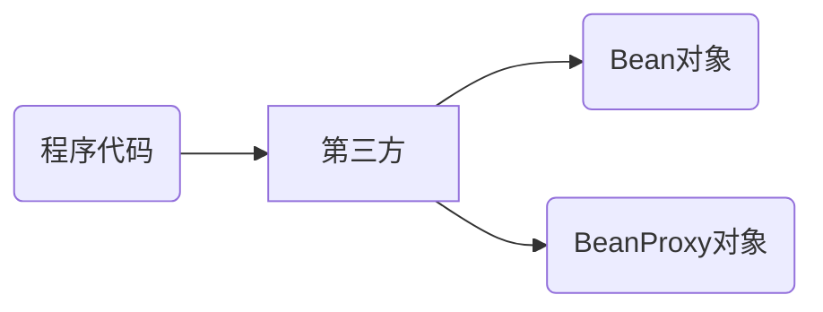
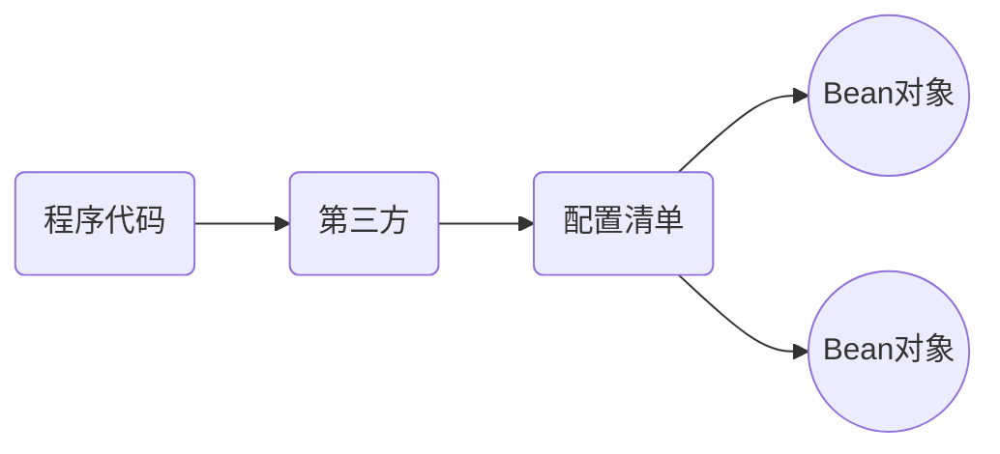

## 传统Java Web开发困惑及解决方案
### 代码示例
先来看一段Java Web代码：
```java
// 用户账户信息修改业务方法
public void updateUserInfo(User user){
    try{
        // 开启事务
        DaoUtils.openTransaction();
        // 获得UserDao执行修改User数据到数据库操作
        UserDao userDao = new UserDaoImpl();
        userDao.updateUserInfo(user);
        // 修改成功后，向用户行为日志表中插入一条数据。包括内容，操作时间，用户，修改行为等信息。
        UserLog userLog = new UserLogImpl();
        userLog.recodeUserUpdate(user);
        // 提交事务
        DaoUtils.commit();
    }catch(Exception e){
        // 回滚事务
        DaoUtils.rollback();
        // 向异常日志表插入数据
        ExceptionLog exceptionLog = new ExceptionLogImpl();
        exceptionLog.recodeException(this, e);
    }
}

// 用户注册业务方法
public void regist(User user){
    try{
        // 开启事务
        DaoUtils.openTransaction();
        // 获得UserDao执行添加User数据到数据库操作
        UserDao userDao = new UserDaoImpl();
        userDao.addUser(user);
        // 注册成功后，向用户行为日志表中插入一条数据。包括内容，操作时间, 用户，注册行为等信息。
        UserLog userLog = new UserLogImpl();
        userLog.recodeUserRegist(user);
        //注册成功后，向用户邮箱发送一封激活邮件
        CommonUtils.sendEmail(user);
        // 提交事务
        DaoUtils.commit();
    }catch(Exception e){
        // 回滚事务
        DaoUtils.rollback();
        // 向异常日志表插入数据
        ExceptionLog exceptionLog = new ExceptionLogImpl();
        exceptionLog.recodeException(this, e);
    }
}
```
两个方法中，主要的业务无非是以下代码，都是获得DAO后再去执行方法：
```java
// 获得UserDao执行修改User数据到数据库操作
UserDao userDao = new UserDaoImpl();
userDao.updateUserInfo(user);

// 获得UserDao执行添加User数据到数据库操作
UserDao userDao = new UserDaoImpl();
userDao.addUser(user);
```

而除了主业务代码外，还包括事务与日志记录等  

事务相关操作：
```java
// 开启事务
DaoUtils.openTransaction();
// 提交事务
DaoUtils.commit();
// 回滚事务
DaoUtils.rollback();
```

日志相关操作：
```java
// 修改成功后，向用户行为日志表中插入一条数据。包括内容，操作时间，用户，修改行为等信息。
UserLog userLog = new UserLogImpl();
userLog.recodeUserUpdate(user);

// 注册成功后，向用户行为日志表中插入一条数据。包括内容，操作时间, 用户，注册行为等信息。
UserLog userLog = new UserLogImpl();
userLog.recodeUserRegist(user);

// 向异常日志表插入数据
ExceptionLog exceptionLog = new ExceptionLogImpl();
exceptionLog.recodeException(this, e);
```

### 代码示例中出现的问题
**问题一：层与层之间紧密耦合；接口与接口之间紧密耦合**
```java
UserDao userDao = new UserDaoImpl();
UserLog userLog = new UserLogImpl();
ExceptionLog exceptionLog = new ExceptionLogImpl();
```
这几行代码作用都是在业务层获取DAO层的操作对象，于是new了这三个对象，拿到对象之后再去调用对应的方法进行操作。但是这样写耦合度会很高。层与层之间耦合度很紧密，接口与具体实现之间耦合度也很紧密。

***解决思路***  
程序代码中不要手动new对象，而是要用第三方根据要求为程序提供需要的bean对象。  

**比如：** 工厂设计模式


**问题二：通用的事务功能与日志功能都耦合在业务代码中**  
不难发现，两个方法中事务功能和日志功能几乎是相同的。事实上，几乎所有的业务层方法都需要这些事务功能和日志功能。

***解决思路***  
程序代码中不要手动new对象，而是要用第三方根据要求为程序提供需要的bean对象的proxy对象。 

**比如：** proxy设计模式。示例中的这两个方法都是业务层的方法（假设为UserService），在获取UserService对象的时候也不手动new，而是通过第三方帮忙提供，但是第三方提供的是一个通过proxy设计模式被增强过的UserService对象，它内部的方法也是被增强过的方法，它内部的方法  具备事务跟日志的功能。


## IoC、DI、AOP概要

为了解决传统Java Web程序代码在获取bean时，不直接new，而是去找第三方，有些bean，我们就要bean对象，有些需要拓展的bean，我们要bean的proxy对象。

### IoC思想
Inversion of Control，控制反转。强调的是把在程序中创建bean的权利反转给第三方。

### DI思想
Dependency Injection，依赖注入。强调的是把Bean之间关系的设置交给第三方。  

**比如：** 有Bean1和bean2两个bean，bean1中有bean2这个属性，正常需要通过第三方先创建bean1，再创建bean2，然后手动把bean2设置给bean1。但通过依赖注入，这种关系通过第三方设置，创建bean1的时候，不需要手动创建bean2，第三方会自动创建bean2并且把bean2设置给bean1。

### AOP思想
Aspect Oriented Programming，面向切面编程。功能的横向抽取，主要的实现方式就是Proxy。

## Spring Framework技术栈图
  

1. Test：单元测试与集成测试
2. Core Container：核心容器，提供了Spring的基本功能，是其他模块建立的基础
   1. Beans模块：提供了BeansFactory，是工厂模式实现的经典，Spring将对象管理为Bean
   2. Core核心模块：提供了Spring框架的基本组成部分，包括IoC和DI
   3. Context上下文模块：构建于核心模块之上，它是访问定义配置的任何对象的媒介，拓展了BeansFactory的功能。其中ApplicationContext是Context模块的核心接口
   4. SpEL模块：是Spring3.0之后新增的模块，提供了Spring Expression Language支持，是运行时查询和操作对象图的强大的表达式语言。
3. AOP模块：提供了面向切面编程的支持，允许定义方法拦截器和切入点，将代码按照功能进行分离，以降低耦合度
4. Aspects模块：AOP模块的拓展，通过集成AspectJ提供了更加强大的AOP功能
5. Instrumentation模块：主要用于提供类加载器增强和字节码操作支持
6. Messaging模块：是Spring4.0之后新增的模块，提供了对消息传递体系结构和协议的支持
7. Data Access/Integration：数据访问/集成层
   1. JDBC模块：提供了一个JDBC的抽象层，大幅度地减少了在开发中对于数据库的操作代码
   2. ORM模块：用于简化JPA（Java Persistence API）、Hibernate、JDO（Java Data Objects）和其他ORM工具与Spring框架集成的模块
   3. OXM模块：提供了一个抽象层，用于支持各种对象/XML映射实现，如JAXB、Castor、XMLBeans、JiBX和XStream
   4. JMS模块：是为了简化在 Spring 应用中使用消息传递服务而设计的模块。 它提供了对 JMS（Java Message Service）规范的支持，使得开发者能够方便地发送和接收消息，与消息代理（如 ActiveMQ、RabbitMQ 等）进行交互。
   5. Transactions事务管理模块：针对JDBC API中关于事务管理这一部分进行了高级抽象，它支持两种方式的事务管理，分别是：声明式事务管理 (Declarative Transaction Management) 与 编程式事务管理 (Programmatic Transaction Management) 。
8. Web层
   1. web模块：提供了核心的Web相关功能的集成，比如IoC容器的初始化、Web应用上下文（context）的初始化、多部（multipart）文件上传功能、HTTP客户端、Servlet 过滤器、远程调用、用于集成其它 web 框架及技术（如Hessian，Burlap）的基础结构。
   2. WebSocket模块：提供了对WebSocket的支持
   3. Servlet模块：也称作spring-webmvc，是 Spring MVC 和 REST 的实现
   4. Portlet 模块，它提供用于portlet环境的 MVC 实现，并具有与 spring-webmvc 模块相同的功能。

## BeanFactory快速入门

BeanFactory的具体实现类是DefaultListableBeanFactory

### BeanFactory的运行逻辑


**IoC思想的实现步骤**  

1. 导入Spring的jar包或者Maven坐标
2. 定义接口及实现类
3. 创建xml配置文件，将实现类的信息配置到该xml文件中
4. 编写测试代码，创建BeanFactory，加载配置文件，获取接口实例对象

**DI思想的实现步骤**  

5. 定义新的接口与实现类
6. 修改原有实现类代码，添加一个setter方法用于接受注入的对象
7. 将新的实现类的信息配置到xml文件中
8. 在原来的`<bean>`标签中嵌入`<property>`标签配置注入

### 代码实例1 IoC思想简单实现
**项目文件结构**
```txt
spring-ioc-test01/
├── src/
│    └── main/
│         ├── java/
|         |     └── com/plasmacookie/
|         |                  ├── service/
|         |                  |      ├── impl/
|         |                  |      |     └── UserServiceImpl.java
|         |                  |      └── UserService.java
|         |                  └── test/
|         |                         └── BeanFactoryTest.java
|         └── resources/
|               └── beans.xml
└── pom.xml
```

**在Maven配置文件中导入spring-context包的坐标-pom.xml**
```xml
<?xml version="1.0" encoding="UTF-8"?>
<project xmlns="http://maven.apache.org/POM/4.0.0"
         xmlns:xsi="http://www.w3.org/2001/XMLSchema-instance"
         xsi:schemaLocation="http://maven.apache.org/POM/4.0.0 http://maven.apache.org/xsd/maven-4.0.0.xsd">
    <modelVersion>4.0.0</modelVersion>

    <groupId>com.plasmacookie</groupId>
    <artifactId>spring-ioc-test01</artifactId>
    <version>1.0-SNAPSHOT</version>

    <properties>
        <maven.compiler.source>8</maven.compiler.source>
        <maven.compiler.target>8</maven.compiler.target>
    </properties>

    <dependencies>
        <dependency>
            <groupId>org.springframework</groupId>
            <artifactId>spring-context</artifactId>
            <version>5.3.39</version>
        </dependency>
    </dependencies>

</project>
```

**新建业务层接口-UserService.java**
```java
package com.plasmacookie.service;

public interface UserService {}
```

**新建业务层接口的实现类-UserServiceImpl.java**
```java
package com.plasmacookie.service.impl;

import com.plasmacookie.service.UserService;

public class UserServiceImpl implements UserService{}
```

**在beans配置文件中配置该实现类的信息-beans.xml**
```xml
<?xml version="1.0" encoding="UTF-8"?>
<beans xmlns="http://www.springframework.org/schema/beans"
       xmlns:xsi="http://www.w3.org/2001/XMLSchema-instance"
       xmlns:context="http://www.springframework.org/schema/context"
       xsi:schemaLocation="http://www.springframework.org/schema/beans
        http://www.springframework.org/schema/beans/spring-beans.xsd
        http://www.springframework.org/schema/context
        http://www.springframework.org/schema/context/spring-context.xsd">

    <!-- 在这里配置您的bean -->
    <bean id="userService" class="com.plasmacookie.service.impl.UserServiceImpl"/>

</beans>
```

**编写测试代码**
```java
package com.plasmacookie.test;

import org.springframework.beans.factory.support.DefaultListableBeanFactory;
import org.springframework.beans.factory.xml.XmlBeanDefinitionReader;

public class BeanFactoryTest {
    public static void main(String[] args) {
        // 创建工厂对象
        DefaultListableBeanFactory beanFactory = new DefaultListableBeanFactory();
        // 为工厂创建读取器
        XmlBeanDefinitionReader reader = new XmlBeanDefinitionReader(beanFactory);
        // 读取beans.xml文件
        reader.loadBeanDefinitions("beans.xml");
        // 使用工厂对象获取需要的bean, 传参为在beans.xml配置的bean的id
        Object userService = beanFactory.getBean("userService");

        System.out.println(userService);
    }
}
```

**运行代码**
```txt
com.plasmacookie.service.impl.UserServiceImpl@546a03af
```

可以看到控制台打印出了userService的地址，说明获取bean成功。

### 代码实例2 DI思想简单实现
**项目文件结构**
```txt
spring-ioc-test01/
├── src/
│    └── main/
│         ├── java/
|         |     └── com/plasmacookie/
|         |                  ├── dao/
|         |                  |    ├── impl/
|         |                  |    |     └── UserDaoImpl.java
|         |                  |    └── UserDao.java
|         |                  ├── service/
|         |                  |    ├── impl/
|         |                  |    |     └── UserServiceImpl.java
|         |                  |    └── UserService.java
|         |                  └── test/
|         |                       └── BeanFactoryTest.java
|         └── resources/
|               └── beans.xml
└── pom.xml
```

**新建数据访问层接口-UserDao.java**
```java
package com.plasmacookie.dao;

public interface UserDao {}
```

**新建数据访问层接口的实现类-UserDaoImpl.java**
```java
package com.plasmacookie.dao.impl;

import com.plasmacookie.dao.UserDao;

public class UserDaoImpl implements UserDao{}
```

**在业务层接口的实现类中添加一个属性，该属性为数据访问层对象-UserServiceImpl.java**
```java
package com.plasmacookie.service.impl;

import com.plasmacookie.dao.UserDao;
import com.plasmacookie.service.UserService;

public class UserServiceImpl implements UserService{
    private UserDao userDao;

    public void setUserDao(UserDao userDao) {
        this.userDao = userDao;
    }
}
```

**在beans配置文件中配置 数据访问层实现类的信息 及 业务层与数据访问层bean之间的关系-beans.xml**
```xml
<?xml version="1.0" encoding="UTF-8"?>
<beans xmlns="http://www.springframework.org/schema/beans"
       xmlns:xsi="http://www.w3.org/2001/XMLSchema-instance"
       xmlns:context="http://www.springframework.org/schema/context"
       xsi:schemaLocation="http://www.springframework.org/schema/beans
        http://www.springframework.org/schema/beans/spring-beans.xsd
        http://www.springframework.org/schema/context
        http://www.springframework.org/schema/context/spring-context.xsd">

    <!-- 在这里配置您的bean -->
    <bean id="userService" class="com.plasmacookie.service.impl.UserServiceImpl">
        <property name="userDao" ref="userDao"/>
    </bean>

    <bean id="userDao" class="com.plasmacookie.dao.impl.UserDaoImpl"/>
</beans>
```
***注意！！！*** property标签中ref属性为userDao的bean标签的id；name属性为UserDaoImpl.java中的setter方法名

**运行代码**  
  

以debug方式再次运行代码，可以看到userService对象的userDao属性不为空。说明程序创建了userDao对象，并自动将userDao设置给了userService

## ApplicationContext快速入门
ApplicationContext 又称作Spring上下文，内部封装了BeanFactory，比BeanFactory功能更强大更丰富。  
在Spring基础环境下，常用的三个ApplicationContext实现类如下：

|实现类|功能描述|
|-|-|
|ClassPathXmlApplicationContext|从类路径(classpath)加载 XML 配置文件的 ApplicationContext 实现|
|FileSystemXmlApplicationContext|从文件系统路径加载 XML 配置文件的 ApplicationContext 实现|
|AnnotationConfigApplicationContext|基于 Java 注解配置的 ApplicationContext 实现，支持 @Configuration 类|


### 代码实例
**项目文件结构**
```txt
spring-ioc-test01/
├── src/
│    └── main/
│         ├── java/
|         |     └── com/plasmacookie/
|         |                  ├── dao/
|         |                  |    ├── impl/
|         |                  |    |     └── UserDaoImpl.java
|         |                  |    └── UserDao.java
|         |                  ├── service/
|         |                  |    ├── impl/
|         |                  |    |     └── UserServiceImpl.java
|         |                  |    └── UserService.java
|         |                  └── test/
|         |                       ├── BeanFactoryTest.java
|         |                       └── ApplicationContextTest.java
|         └── resources/
|               └── beans.xml
└── pom.xml
```

**新增ApplicationContextTest.java**
```java
package com.plasmacookie.test;

import org.springframework.context.ApplicationContext;
import org.springframework.context.support.ClassPathXmlApplicationContext;

public class ApplicationContextTest {
    public static void main(String[] args) {
        // 创建ApplicationContext，加载配置文件，实例化容器
        ApplicationContext applicationContext = new ClassPathXmlApplicationContext("beans.xml");
        // 根据beanname获取容器中的bean实例
        Object userService = applicationContext.getBean("userService");
        System.out.println(userService);
    }
}
```

**运行结果**
```txt
com.plasmacookie.service.impl.UserServiceImpl@520a3426
```

可以看到控制台打印出了userService的地址，说明获取bean成功。

## BeanFactory与ApplicationContext的关系

1. ApplicationContext包含了BeanFactory的所有功能，并且增加了国际化、资源访问、事件机制等高级特性
2. bean加载时机不同，BeanFactory只有在实际使用到某个bean时才创建这个bean，而ApplicationContext则在容器启动时就创建所有的bean
3. ApplicationContext不仅继承了BeanFactory，而且 ApplicationContext内部维护着BeanFactory实例
